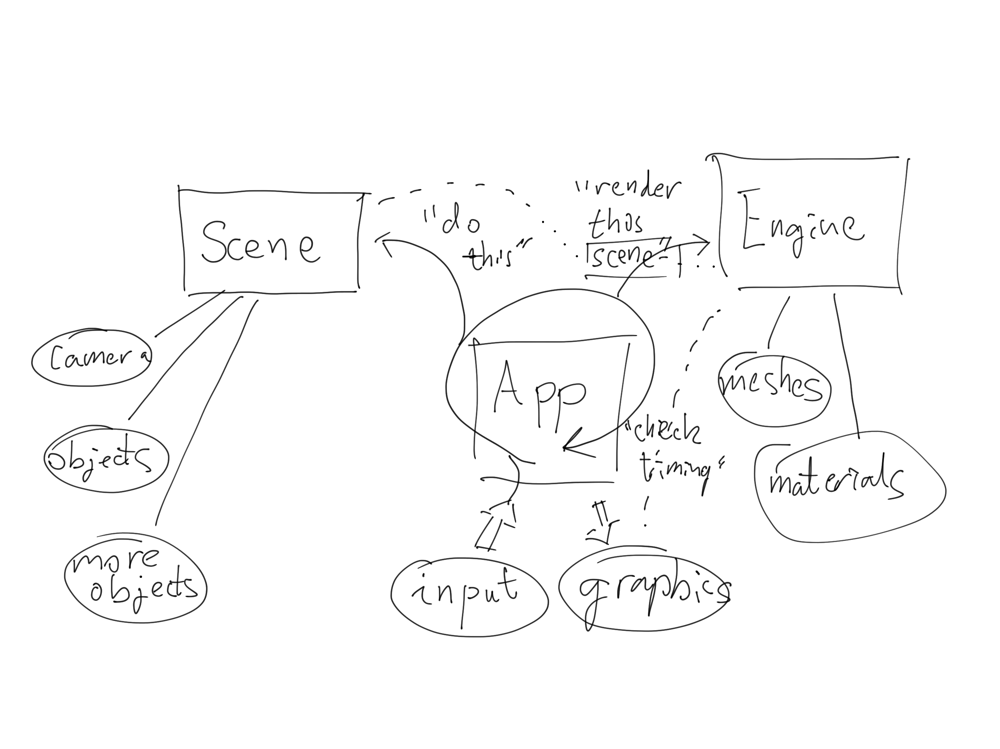

# COSC3000 Practical 2:
## Cameras and Projections
In this practical we'll complete our investigation of the model/view/projection transformation stack by looking at projection and view transforms. We'll also see how to implement first and third person cameras.
### Getting some Perspective
Navigate to the "projected triangle" folder, then in the apps initialization, look at the line
```python
self.triangle = Component(
    position = [0,0,0],
    eulers = [0,0,0]
)
```
Try changing the z value of position, what effect does it have? For which range of values does the triangle appear on the screen? By default, OpenGL works in Normalized Device Coordinates (NDC),


The convention of negative z defining the visible space can be confusing, it's based around the right hand rule if that makes things easier to remember. Other graphics APIs get around this by using the left hand rule, or reversing the direction of y. Anyway, z values in the range [-1,1] seem to work, but the size of the triangle doesn't change based on how far away it is. Adding a perspective transformation can fix this. Head to the vertex shader and declare it as a uniform:

vertex.txt:
```
#version 330 core

layout (location=0) in vec3 vertexPos;
layout (location=1) in vec3 vertexColor;

uniform mat4 model;
uniform mat4 projection;

out vec3 fragmentColor;

void main()
{
    gl_Position = projection * model * vec4(vertexPos, 1.0);
    fragmentColor = vertexColor;
}
```

So as we can see, we first hit the triangle with the model transform, which sends it from model (local) space to world space, then we hit it with a projection transform, which will send it from world space to clip space (so called because anything outside of this region is clipped). Pyrr has a handy function for making such a perpective projection matrix:
```python
pyrr.matrix44.create_perspective_projection(fovy, aspect, near, far, dtype)
```
- fovy: angle of vertical view. Setting this wider can give a more "fisheye" looking view. setting it smaller makes everything tighter, more zoomed in
- aspect: width/height
- near: everything closer than this distance will be ignored
- far: everything further than this distance will be ignored
- dtype: as with all matrices, set this to 32 bit floating point in order to work properly

We can create a perspective transform and send it in. For our example we're setting and forgetting, so we can call this once in the app initialization:

```python
projection_transform = pyrr.matrix44.create_perspective_projection(
    fovy = 45, aspect = 640 / 480, near = 0.1, far = 10, dtype = np.float32
)
glUniformMatrix4fv(glGetUniformLocation(self.shader, "projection"), 1, GL_FALSE, projection_transform)
```

Now try playing with the triangle's z coordinate again. What ranges are acceptable? What effect does it have?

Note: Due to the perspective division stage which openGL performs after all transformations, we can't set the "near" distance to zero. Division by zero is, like, not great. Also, it's tempting to set near = 0.001, far = 9999, or somesuch, but that's a bad idea. As discussed in lectures, the perspective transformation matrix is approximating the depth value with a linear transformation, and the accuracy of this approximation gets worse as the the difference between near and far increases. For most cases it's unnoticeable, but in an extreme case, it will produce weird visual effects. Especially in the next prac, where we look at depth testing.

### View transform
This is good and all, but there are some issues. What if we want a moving, rotating camera? Or we want to specify z as the vertical axis, with x and y making up the horizontal plane? We need to take the world and transform it from world coordinates to the standardized form we've been using in previous examples. This is called a view transform, it converts world coordinates to so called view coordinates. To illustrate the basic idea, load up the view prototype. Play around with it and convince yourself, the camera stays still and the world moves around it. There are two basic steps:
- subtract the camera's position from all coordinates, this sets the camera as the center of the world.
- rotate all points opposite to the camera's angle. Camera spins left? No dude, the camera's actually staying still and the world is spinning right

Open up the "first person camera" folder. The same principle of this prototype applies in general, we add a third matrix to our vertex shader.

vertex.txt:
```
#version 330 core

layout (location=0) in vec3 vertexPos;
layout (location=1) in vec3 vertexColor;

uniform mat4 model;
uniform mat4 view;
uniform mat4 projection;

out vec3 fragmentColor;

void main()
{
    gl_Position = projection * view * model * vec4(vertexPos, 1.0);
    fragmentColor = vertexColor;
}
```

Now let's make a camera object.
```python
class Camera:


    def __init__(self, position, eulers):

        self.position = position
        self.eulers = eulers

        #local directions (before rotation)
        self.localUp = np.array([0,0,1], dtype=np.float32)
        self.localRight = np.array([0,1,0], dtype=np.float32)
        self.localForwards = np.array([1,0,0], dtype=np.float32)

        #directions after rotation
        self.up = np.array([0,0,1], dtype=np.float32)
        self.right = np.array([0,1,0], dtype=np.float32)
        self.forwards = np.array([1,0,0], dtype=np.float32)

        self.viewTransform = pyrr.matrix44.create_identity(dtype=np.float32)
    
    def update(self):

        #get camera's rotation
        cameraRotation = pyrr.matrix33.create_from_eulers(
            eulers = np.radians(self.eulers), 
            dtype=np.float32
        )
        self.up = pyrr.matrix33.multiply(
            m1 = self.localUp,
            m2 = cameraRotation
        )
        self.right = pyrr.matrix33.multiply(
            m1 = self.localRight,
            m2 = cameraRotation
        )
        self.forwards = pyrr.matrix33.multiply(
            m1 = self.localForwards,
            m2 = cameraRotation
        )

        #create camera's view transform
        self.viewTransform = pyrr.matrix44.create_look_at(
            eye = self.position,
            target = self.position + self.forwards,
            up = self.up,
            dtype = np.float32
        )
```
We're holding three fundamental directions in the camera object, its forwards, up and right vectors. The lookat function only needs the forwards and up vectors, but we might want the right vector too in some cases (eg. the later exercise with a third person camera).

Also, the program is getting a little bigger, it might be a good idea to wrap the game objects up in a scene object.

```python
class Scene:


    def __init__(self):

        self.triangle = Component(
            position = [3,0,0],
            eulers = [0,0,0]
        )

        self.camera = Camera(
            position = [0,0,0],
            eulers = [0,0,0]
        )
    
    def update(self, rate):

        self.triangle.update(rate)
        self.camera.update()
    
    def move_camera(self, dPos):

        self.camera.position += dPos
    
    def spin_camera(self, dEulers):

        self.camera.eulers += dEulers

        if self.camera.eulers[1] < 0:
            self.camera.eulers[1] += 360
        elif self.camera.eulers[1] > 360:
            self.camera.eulers[1] -= 360
        
        self.camera.eulers[2] = min(89, max(-89, self.camera.eulers[2]))
```
The extra checks in spin_camera are just making sure the camera's z axis (horizontal plane) rotation is in the range [0,360], and that the y axis rotation (vertical looking) is clamped to [-89,89].

Also note that in the update function we also take an update rate, this is a multiplier that takes into account how fast the program is running. In the case of the triangle we use it like this:

```python
def update(self, rate):

    self.eulers[2] += 0.25 * rate
    if self.eulers[2] > 360:
        self.eulers[2] -= 360
        
    ...
```

Now we can update the app to create the new scene object, handle user input and render everything.

```python
class App:


    def __init__(self):
        #initialise pygame
        pg.init()
        pg.mouse.set_visible(False)
        pg.display.gl_set_attribute(pg.GL_CONTEXT_MAJOR_VERSION, 3)
        ...
        self.screenWidth = 640
        self.screenHeight = 480
        pg.mouse.set_pos((self.screenWidth // 2,self.screenHeight // 2))
        pg.display.set_mode((self.screenWidth,self.screenHeight), pg.OPENGL|pg.DOUBLEBUF)
        ...
        glUseProgram(self.shader)

        self.scene = Scene()
        self.triangle_mesh = TriangleMesh()

        ...

        self.modelMatrixLocation = glGetUniformLocation(self.shader,"model")
        self.viewMatrixLocation = glGetUniformLocation(self.shader, "view")

        self.lastTime = pg.time.get_ticks()
        self.currentTime = 0
        self.numFrames = 0
        self.frameTime = 0

        self.mainLoop()

    def createShader(self, vertexFilepath, fragmentFilepath):

        ...

    def mainLoop(self):
        running = True
        while (running):
            #check events
            for event in pg.event.get():
                if (event.type == pg.KEYDOWN and event.key == pg.K_ESCAPE):
                    running = False
                if (event.type == pg.QUIT):
                    running = False
            
            self.handleKeys()
            self.handleMouse()
            
            #update scene
            rate = self.frameTime / 16
            self.scene.update(rate)
            
            #refresh screen
            glClear(GL_COLOR_BUFFER_BIT)
            glUseProgram(self.shader)

            glUniformMatrix4fv(self.modelMatrixLocation,1,GL_FALSE,self.scene.triangle.modelTransform)
            glBindVertexArray(self.triangle_mesh.vao)
            glDrawArrays(GL_TRIANGLES, 0, self.triangle_mesh.vertex_count)

            pg.display.flip()

            #timing
            self.calculateFramerate()
        self.quit()
    
    def handleKeys(self):

        keys = pg.key.get_pressed()
        combo = 0
        directionModifier = 0
        rate = self.frameTime / 16
        """
        w: 1 -> 0 degrees
        a: 2 -> 90 degrees
        w & a: 3 -> 45 degrees
        s: 4 -> 180 degrees
        w & s: 5 -> x
        a & s: 6 -> 135 degrees
        w & a & s: 7 -> 90 degrees
        d: 8 -> 270 degrees
        w & d: 9 -> 315 degrees
        a & d: 10 -> x
        w & a & d: 11 -> 0 degrees
        s & d: 12 -> 225 degrees
        w & s & d: 13 -> 270 degrees
        a & s & d: 14 -> 180 degrees
        w & a & s & d: 15 -> x
        """

        if keys[pg.K_w]:
            combo += 1
        if keys[pg.K_a]:
            combo += 2
        if keys[pg.K_s]:
            combo += 4
        if keys[pg.K_d]:
            combo += 8
        
        if combo > 0:
            if combo == 3:
                directionModifier = 45
            elif combo == 2 or combo == 7:
                directionModifier = 90
            elif combo == 6:
                directionModifier = 135
            elif combo == 4 or combo == 14:
                directionModifier = 180
            elif combo == 12:
                directionModifier = 225
            elif combo == 8 or combo == 13:
                directionModifier = 270
            elif combo == 9:
                directionModifier = 315
            
            dPos = 0.1 * rate * np.array(
                [
                    np.cos(np.deg2rad(self.scene.camera.eulers[1] + directionModifier)),
                    np.sin(np.deg2rad(self.scene.camera.eulers[1] + directionModifier)),
                    0
                ],
                dtype = np.float32
            )

            self.scene.move_camera(dPos)

    def handleMouse(self):

        (x,y) = pg.mouse.get_pos()
        rate = self.frameTime / 16
        theta_increment =  10 * rate * ((self.screenWidth // 2) - x)
        phi_increment = 10 * rate * ((self.screenHeight // 2) - y)
        dTheta = np.array([0, theta_increment, phi_increment], dtype=np.float32)
        self.scene.spin_camera(dTheta)
        pg.mouse.set_pos((self.screenWidth // 2,self.screenHeight // 2))

    def calculateFramerate(self):

        self.currentTime = pg.time.get_ticks()
        delta = self.currentTime - self.lastTime
        if (delta >= 1000):
            framerate = max(1,int(1000.0 * self.numFrames/delta))
            pg.display.set_caption(f"Running at {framerate} fps.")
            self.lastTime = self.currentTime
            self.numFrames = -1
            self.frameTime = float(1000.0 / max(1,framerate))
        self.numFrames += 1
    
    def quit(self):
        self.triangle_mesh.destroy()
        glDeleteProgram(self.shader)
        pg.quit()
```
This is quite a bit, we make the mouse invisible because we're going to keep it fixed on the screen then measure how far it moves each frame. This is a little distracting, hance hiding the mouse. 

We are also going to actually measure the framerate every second as opposed to keeping framerate capped at 60fps. For this we need a few extra variables. Basically, the number of frames which have been rendered since the last framerate update, and the time when that occured. The program will count the number of frames rendered and use this to get the framerate and frametime (number of milliseconds to render a frame) once per second.

In our mainloop, since the mouse is effectively disabled, we also check for the user hitting the escape key. Then we go ahead and check for wasd and mouse input. 

The key input code is a little technical, it's basically using what's called a bitmask technique to check individual combinations of wasd, then getting a direction offset to add to the player's own direction when walking.

As for the mouse, we measure the mouse's position, find its displacement from the center, use that to spin the player, then reset the mouse to screen center.

In the rendering code, we query the camera's view transform, then pass that to our shader. We grabbed the uniform location in the init function already so it's quite straightforward. Go ahead and run this, and verify that the first person camera is working correctly. As an aside, the app class is getting fairly large and can be split up futher. This will be done in future pracs, for now here's a diagram of my preferred program organisation:



### Third Person Camera
We know how to make a first person camera! That's cool, how can we extend it? Well obviously if we represent the camera and player as different objects, then put some distance between them, we'll have a basic third person camera. But there are some extra features we can add.

Let's say we want the camera to focus on the player, spin around the camera when we press a or d, then pivot above or below the player when we press w or s, this is where the camera's up and right vectors will be really useful. Navigate to "Third Person Camera" and add/modify the following classes:

```python
class Component:


    def __init__(self, position, eulers, scale):

        self.position = np.array(position, dtype=np.float32)
        """
            pitch: rotation around x axis
            roll:rotation around z axis
            yaw: rotation around y axis
        """
        self.eulers = np.array(eulers, dtype=np.float32)
        self.scale = np.array(scale, dtype=np.float32)
        self.modelTransform = pyrr.matrix44.create_identity()
    
    def update(self, rate):

        ...
        
        self.modelTransform = pyrr.matrix44.create_identity()
        self.modelTransform = pyrr.matrix44.multiply(
            m1 = self.modelTransform,
            m2 =  pyrr.matrix44.create_from_scale(
                scale = self.scale,
                dtype = np.float32
            ) 
        )
        ...

class Player:


    def __init__(self, position, eulers, scale):
        self.position = np.array(position,dtype=np.float32)
        self.eulers = np.array(eulers,dtype=np.float32)
        self.scale = np.array(scale,dtype=np.float32)
        self.camera = None
    
    def update(self, rate, target):

        if target is not None:
            self.move_towards(target.position, 0.1 * rate)
        
        self.modelTransform = pyrr.matrix44.create_identity()
        self.modelTransform = pyrr.matrix44.multiply(
            m1 = self.modelTransform,
            m2 =  pyrr.matrix44.create_from_scale(
                scale = self.scale,
                dtype = np.float32
            ) 
        )
        self.modelTransform = pyrr.matrix44.multiply(
            m1 = self.modelTransform,
            m2 = pyrr.matrix44.create_from_eulers(
                eulers = np.radians(self.eulers),
                dtype = np.float32
            )
        )
        self.modelTransform = pyrr.matrix44.multiply(
            m1 = self.modelTransform,
            m2 = pyrr.matrix44.create_from_translation(
                vec = self.position,
                dtype = np.float32
            )
        )

    def move(self, direction, amount):
        self.position[0] += amount * np.cos(np.radians(direction),dtype=np.float32)
        self.position[1] -= amount * np.sin(np.radians(direction),dtype=np.float32)
        self.camera.position[0] += amount * self.moveSpeed * np.cos(np.radians(direction),dtype=np.float32)
        self.camera.position[1] -= amount * self.moveSpeed * np.sin(np.radians(direction),dtype=np.float32)
        self.eulers[1] = direction

    def move_towards(self, targetPosition, amount):
        directionVector = targetPosition - self.position
        angle = np.arctan2(-directionVector[1],directionVector[0])
        self.move(np.degrees(angle), amount)

class Camera:

    def __init__(self, position):

        self.position = np.array(position,dtype=np.float32)
        self.forward = np.array([0, 0, 0],dtype=np.float32)
        self.right = np.array([0, 0, 0],dtype=np.float32)
        self.up = np.array([0, 0, 0],dtype=np.float32)
        self.localUp = np.array([0, 0, 1], dtype=np.float32)
        self.targetObject = None

    def update(self, shaders):
        self.forward = pyrr.vector.normalize(self.targetObject.position - self.position)
        self.right = pyrr.vector.normalize(pyrr.vector3.cross(self.forward, self.localUp))
        self.up = pyrr.vector.normalize(pyrr.vector3.cross(self.right, self.forward))

        lookat_matrix = pyrr.matrix44.create_look_at(self.position, self.targetObject.position, self.up,dtype=np.float32)
        for shader in shaders:
            glUseProgram(shader)
            glUniformMatrix4fv(glGetUniformLocation(shader,"view"),1,GL_FALSE,lookat_matrix)
            glUniform3fv(glGetUniformLocation(shader,"cameraPos"),1,self.position)
```
The component class is getting a scale attribute to help differentiate between different types of objects, otherwise nothing changes there.

The player is very similar to the component except it has the ability to move towards points, note that the y coordinates are flipped around, this is in order account for pygame's flipped y coordinate axis. The player also has a reference to the camera object so that when it moves, it pulls the camera along with it.

The camera object is now using the vector cross product to calculate its right and up vectors. The reason for this is that we want it to look at arbitrary points, so keeping track of its direction and then rotating things is less convenient. It has a reference to the player object so that it always knows which point to look at.

These objects can then be created in the Scene class:
```python
class Scene:


    def __init__(self):

        self.player = Player(
            position = [0,1,0],
            eulers = [0,0,0],
            scale = [1,1,1]
        )
        self.camera = Camera(position = [-3,1,3])
        self.player.camera = self.camera
        self.camera.targetObject = self.player

        self.click_dots = []

        #make row of triangles
        self.triangles = []
        for x in range(1,16,3):
            self.triangles.append(
                Component(
                    position = [x,1,0.5],
                    eulers = [0,0,0],
                    scale = [0.5, 0.5, 0.5],
                )
            )
```
This will give us a player (which will be represented by a large triangle), and a row of medium triangles for visual orientation. We also are going to lay dots (small triangles) on the ground when the player clicks.
Getting back to that camera strafing, we'll need a function to move the camera.
```python
def move_camera(self, dPos):

    self.camera.position += dPos[0] * self.camera.forward \
        + dPos[1] * self.camera.right \
        + dPos[2] * self.camera.up
```
The camera's position shifts according to its fundamental vectors, say the camera takes a step to its right, but it's still looking at the player, who hasn't moved, this produces circular motion.
We also need a general function to make dots.
```python
def lay_down_dot(self, position):
    self.click_dots.append(
        Component(
            position = position,
            eulers = [0,0,0],
            scale = [0.1, 0.1, 0.1],
        )
    )
```
And finally to update the whole scene:
```python
def update(self, rate):

    for triangle in self.triangles:
        triangle.update(rate)
    for dot in self.click_dots:
        dot.update(rate)
    targetDot = None
    if len(self.click_dots) > 0:
        targetDot = self.click_dots[0]
    self.player.update(rate, targetDot)
    self.camera.update()

    #check if dot can be deleted
    if targetDot is not None:
        if pyrr.vector.length(targetDot.position - self.player.position) < 0.01:
            self.click_dots.pop(self.click_dots.index(targetDot))
```

The scene looks good for now, we can turn our attention to the app. Because we want to click on the screen, we can get rid of the line to hide the mouse. There are some minor adjustments to make:
```python
def __init__(self):
        ... (remove mouse invisible line)
        
        glEnable(GL_DEPTH_TEST)

        ...
        #increase the far distance a little

        projection_transform = pyrr.matrix44.create_perspective_projection(
            fovy = 45, aspect = 640 / 480, near = 0.1, far = 50, dtype = np.float32
        )
        ...
```
Then we can go to the mainloop and make sure all the objects in the scene are being drawn. There are also some slight variations here.
```python
def mainLoop(self):
    running = True
    while (running):
        #check events
        for event in pg.event.get():
            if (event.type == pg.KEYDOWN and event.key == pg.K_ESCAPE):
                running = False
            if (event.type == pg.QUIT):
                running = False
            if (event.type == pg.MOUSEBUTTONDOWN):
                self.handleMouse()
            
        self.handleKeys()
            
        #update scene
        rate = self.frameTime / 16
        self.scene.update(rate)
            
        #refresh screen
        glClear(GL_COLOR_BUFFER_BIT | GL_DEPTH_BUFFER_BIT)
        glUseProgram(self.shader)

        glUniformMatrix4fv(self.viewMatrixLocation, 1, GL_FALSE, self.scene.camera.viewTransform)

        glUniformMatrix4fv(self.modelMatrixLocation,1,GL_FALSE,self.scene.player.modelTransform)
        glBindVertexArray(self.triangle_mesh.vao)
        glDrawArrays(GL_TRIANGLES, 0, self.triangle_mesh.vertex_count)

        for triangle in self.scene.triangles:
            glUniformMatrix4fv(self.modelMatrixLocation,1,GL_FALSE,triangle.modelTransform)
            glBindVertexArray(self.triangle_mesh.vao)
            glDrawArrays(GL_TRIANGLES, 0, self.triangle_mesh.vertex_count)
            
        for dot in self.scene.click_dots:
            glUniformMatrix4fv(self.modelMatrixLocation,1,GL_FALSE,dot.modelTransform)
            glBindVertexArray(self.triangle_mesh.vao)
            glDrawArrays(GL_TRIANGLES, 0, self.triangle_mesh.vertex_count)

        pg.display.flip()

        #timing
        self.calculateFramerate()
    self.quit()
```
Almost done! We just need to define the wasd keys and mouse clicks. We have the scene set up so that if it takes a vector it'll move strafe the camera. Let's use that.
```python
def handleKeys(self):

    keys = pg.key.get_pressed()
    rate = self.frameTime / 16
    camera_movement = [0,0,0]

    if keys[pg.K_w]:
        #up
        camera_movement[2] += 1
    if keys[pg.K_a]:
        #left
        camera_movement[1] -= 1
    if keys[pg.K_s]:
        #down
        camera_movement[2] -= 1
    if keys[pg.K_d]:
        #right
        camera_movement[1] += 1
            
    dPos = 0.1 * rate * np.array(
        camera_movement,
        dtype = np.float32
    )

    self.scene.move_camera(dPos)
```
For the mouse click we want to turn screen coordinates into world coordinates. This seems intimidating at first, until we realize that's literally the purpose of the camera's forwards, right and up vectors.

The concept is simple enough, we take the mouse's displacement from the center, divide by some normalizing factor (in this case, the width of the screen), then that indicates the coefficients a and b to use in the vector addition on the diagram. This resultant vector is the direction passing from the camera's eye, though the point that the user clicked on, we can then loop (or solve a simple linear equation) to calculate the point on the ground. Here's the full function:
```python
def handleMouse(self):

        #fetch camera's vectors
        forward = self.scene.camera.forward
        up = self.scene.camera.up
        right = self.scene.camera.right

        #get mouse's displacement from screen center
        (x,y) = pg.mouse.get_pos()
        rightAmount = (x - self.screenWidth//2)/self.screenWidth
        upAmount = (self.screenHeight//2 - y)/self.screenWidth

        #get resultant direction (from camera eye, through point on screen)
        resultant = pyrr.vector.normalize(forward + rightAmount * right + upAmount * up)

        #trace from camera's position until we hit the ground
        if (resultant[2] < 0):
            x = self.scene.camera.position[0]
            y = self.scene.camera.position[1]
            z = self.scene.camera.position[2]
            while (z > 0):
                x += resultant[0]
                y += resultant[1]
                z += resultant[2]
            self.scene.lay_down_dot(
                position = [x,y,0]
            )
```
And that's it! If we run the program now we should be able to use wasd to spin the camera around the player, and clicking should lay down points for the player to move to. As always, double check your program against the finished copy if things aren't quite working.

#### Bonus: Creative use of Transformations

Load up the "Kurtosis" folder, and try the program out. What's happening here? Even without using textures or fancy graphics programming, it's possible to make some pretty cool things by playing with transformations.
